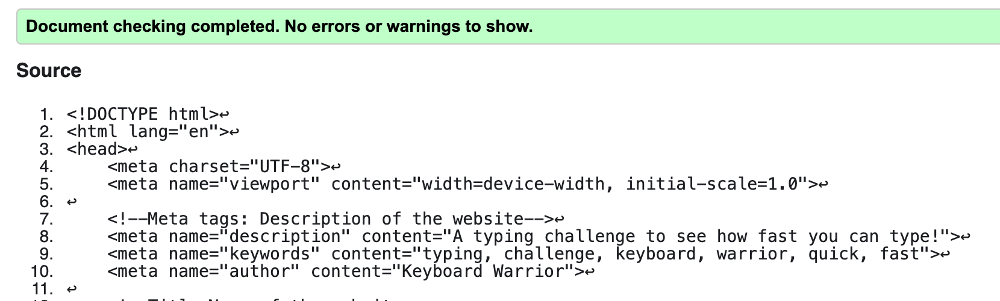

# Keyboard Warrior
Keyboard Warrior is a fun website that challenges visitors and their friends to test their speed in using a keyboard against themself or eachother. As Keyboard Warrior entertains users with a challenge, it also drives accuracy in typing in speed ensuring the correct punctiations and spelling are captured without the help of auto correct or predictive text. The main aim of the website is to entertain its users with a typing challenge and inadvertently improve typing skills.

Keyboard Warrior will attract a young audience, mainly secondary school students up to young adults. Keyboard Warrior is an interactive website with an entertaining challenge to for the user to beat themselves and others by recording the quickest against different challenge sentences.

[Visit website here](https://stringermus.github.io/keyboard-warrior/)

### Colour theme and design
To make Keyboard Warrior look interesting, the site is essentially a dark theme with the information being lighter. I thought it would be best to give the feeling of a 'computer-centric' game in relation the site is typing challenge.

I have chosen a shade of green as the primary colour and on a background of dark blue to complement the green and ensure it stands out. The most important game information is in yellow to help seperate the information which will catch the eye of the user.

#### Logo
The logo is a typing icon that appears when a sender is typing and the receiver can see a text message is being prepared.

This is suitable logo for this website as it represents the nature of the typing challenge well by highlighting the main aspect of the challenge, typing.

The logo was created and downloaded with the help of www.freelogodesign.org/

## Features
The website is a single page site, the page is essentially split into 5 sections but the main part of the web page will be the game area.

### Header
The header only contains the logo, since its a single page website there is not a need for a nav bar to take the user to other pages. The logo has a link to the website as it would be expected by users to take them back to the home page.

### Introduction
The introduction section gives the user the sites purpose by presenting the user with a challenge by challenging the visitor to type quickly. If the user needs further explanation on how the challenge works, there is a link to the rules section which takes the user further down the page.

### Game-area
The game-area will be where users will spend most of the time on the site and where the javascript has been implemented. The game-area can be broken down into 4 more sections - the challenge, user input, time and replay.

#### The Challenge
The user is presented with the instruction to type the challenge sentence below, the challenge is an array of sentences that have been taken from idioms.

<li>
These senetences are always randomised whenever the page is loaded or the game is replayed, they also always appear in a random order so the challenge is not predictedable for the user to not bore easily.
</li> 
 
<li>The user will also not be able to copy the challenge as the selection text selection has been disabled for this section.
</li>

#### User Input
The input area has been created as form for a user to be able to use the input box and submit their entry. The entry needs to match the challenge - this includes spelling, punctuations and capitilisation.

<li>
Once the entry is submitted, the users entry is validated against the challenge that appears above the input box. If the users entry does not match the challenge, a message will appear informing the user if the entry matches or not.
 
 
<li>
Auto-fill has been disabled so it does distract the user with suggestions and users cannot also cheat if they had already submitted a challenge they had already done.
</li>
 
 
<li>
The input box locks after the the challenge has been submitted for users to be unable to try and submit again to ensure the user only has 1 attempt to submit a single challenge.
</li>
 
 
<li>
Focus has been added to the inbox for the input box to already selected ready to type to add convinience for users, notifying and prompting users to type.
</li>
 
 
<li>
The submit button has been hidden to have the user press 'Enter' to submit which will be quicker then clicking the button to ensure users are recording a more accurate time when they are ready to submit their entry.
</li>

#### Timer
The timer begins as soon as the users starts typing in the input box, the timer simply stops when the hit enter which will show the user the time it took for them to complete the challenge.
<li>
The start, stop and reset buttons have been hidden so they are only triggered by events.
</li>

#### Play Again
The Play Again feature only appears after the user has made a submission to be able to restart the game for the user to play again. Once this has been clicked the:
<li>the timer resets to zero which it start from once the next challenge is played;</li>
<li>the success/error messages are hidden again;</li> 
<li>the form is cleared and the input box is made active again;</li>
<li>the play again feature is hidden;</li>
<li>and the challenge array is re-shuffled for a new challenge.</li>

### Rules
The rules section is there for the user if needed to clarify further the objective of the challenge and how it works. It's a small section that has been split in 3 sections to help make it easy to understand.

There is a back to top feature to take the user back to the challenge if they had used the 'Rules' button at the top to arrive at the Rules section and are unaware they can scoll back up to the challenge.

### Footer
The page finishes off with the footer, and there is only logo at the bottom which is linked to the webpage and will always take the user back to the homepage when clicked.

### Features to implement
For the future the website should look to include a score system to record that quickest times the user has been able to record against each challenge.

The site should also have a all-time scoreboard of quickest times that have been recorded by all users against each challenge on this website.

It would be also good to add options for users to be able to select a level of difficulty for users to select how difficult they would like the challenges. 

## Testing

### Header
I have started testing the site on laptop screen size. Keyboard Warrior is a single page website, when I arrive on the website I am met by the header and intro. The intro banner contains the logo, it is inside a white banner and stands our against the dark blue background below it.

If I click the logo, this re-loads the page and takes me back to the site

### Introduction
In the intro section I am presented with a challenge. Under the header the website begins with 'Challenge' in big green letters asking the user how fast they can type.

If I am unsure of the rules there is a button called rules under the challenge.

### Rules
If I click the 'Rules' button it takes me to the Rules section further down the page which can clarify how the game works. The rules are broken down into three parts to simplify the game functions.

There is 'Back to top' link in the rules section to take me back to where I had been been before clicking the Rules button.

### Game-area
Underneath the Intro section, I can see the game-area. The game-area starts with the site asking me 'Type the sentence below'. Below this I can see the challenge sentence in big yellow letters which has my attention, the challenge sentence changes everytime the page is loaded.

Underneath the challenge sentence I can see white font telling me to type in the input below it, the input box is already selected ready for me to type.

I can see I need to hit enter to submit my entry. When I try to submit an empty input I get an error pop-up adivising the field is empty.

I am unable to select and copy the challenge sentence when I attempt it.

#### Input box
As soon as I start typing I can see the timer start which is in yellow writing underneath text telling this is my time.

When I type in the challenge in the input box there is no predictive text or auto-fill dropdown feature to assist my entry. When I submit my entry by pressing 'Enter' the timer stops, I can see my time but I can also see a message in light red box pop up below the input box telling me my entry is incorrect.

Although the input field is now locked, I can review what I have typed by scrolling through my entry to see what I have typed wrong and I can see there is a spelling mistake.

#### Play again
A 'Play Again' feature has also appeared underneath the time after I submitted the entry. When I click this a new challenge sentence replaces the previous one, the input field is cleared and selected as it now active to type inside. The error message has also now gone, the timer is reset back to '0' and the play again feature is hidden again.

#### Success
When I attempt to start typing the new challenge in the input box the timer starts again from 0 and I press 'Enter' to submit my entry, the timer stops to show the time I have taken and this time a message in a green box appears informing I have typed in the challenge correctly. I can review the input box again to see my entry matches the challenge. The input box is disbaled after my submission and the play again feature appears.

Again when click 'Play Again' this resets the game again with a new challenge sentence, timer reset to 0, the input box cleared and active, the outcome message and 'Play Again' feature hidden.

### Footer
When I scroll further down the page and go passed the rules section I have already viewed underneath the game-area, the footer as the web logo. When this is clicked this reloads the webpage and takes me back to the top of the page.

### Responsiveness
I have tested the site on different screen sizes on mobile screens-size (320px), tablets & larger (768px and up), laptops & desktops (992px and up) and screens with min-width of 1200px.

The site responds to these screen sizes well, the site is centralised so it is very consistent in how the elements are presented to the user and the information on the diffetent screens are readable.

### Bugs/Fixes
I have found a slight issue in the Rules button in the intro section and 'Back to Top' link at the bottom of the page, the links are clickable on the same row but outside of the button and 'Back to Top'element.

I have now amended this by removing the 'p' elements in the html in the syntax and having the required content with 'a' elements. This has now fixed the issue and the links are now only clickable inside the button and 'Back to top' link.

I have also found a loophole for cheating. Even though I disabled text selection of the challenge sentence, if the user selects text from above challenge and down passed the challenge the user can copy and paste the text into the input box and then remove the words they dont need to submit which will record the time as '0' seconds. I have now disabled text selection within the website to prevent this by placing 'onmousedown="return false"' within the relevant syntax.

## Validator Testing
### HTML Validator
An error has been identified with an onselect function within html.

I have removed this from the html and amended the stray tags.

### CSS Validator
2 errors were identified in the css regarding font weight values.

I have removed the font weight codes as they were not having any effect on the css.

### JS Hint
There were 3 warnings - there were missing semi colons, which I have now added them in.

There are now no errors or warnings;

#### Metrics
There are 7 functions in this file.
Function with the largest signature take 1 arguments, while the median is 0.
Largest function has 12 statements in it, while the median is 3.
The most complex function has a cyclomatic complexity value of 2 while the median is 1.

## Deployment
Keyboard Warrior has been deployed using GitHub's Pages;

<li>Within the Keyboard Warrior repository, navigate into the 'Settings'.</li>
<li>Within 'Settings' go into the Pages tab.</li>
<li>Under branch select the 'main' branch and the 'root' folder.</li>
<li>After the page is refreshed, it states the site is live at https://stringermus.github.io/keyboard-warrior/</li>

## Credit

Logo and Favicon
https://www.freelogodesign.org/

Favicon html syntax
https://www.w3schools.com/howto/howto_html_favicon.asp#:~:text=To%20add%20a%20favicon%20to,is%20%22favicon.ico%22.

Web icons
https://fontawesome.com/