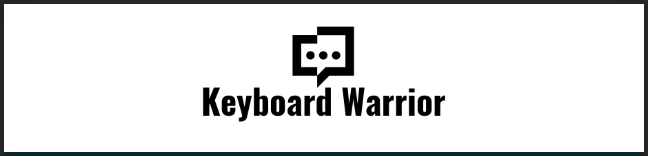

# Keyboard Warrior

Keyboard Warrior is a fun website that challenges visitors and their friends to test their speed in using a keyboard against themself or eachother. As Keyboard Warrior entertains users with a challenge, it also drives accuracy in typing in speed ensuring the correct punctiations and spelling are captured without the help of auto correct or predictive text. The main aim of the website is to entertain its users with a typing challenge and inadvertently improve typing skills.

Keyboard Warrior will attract a young audience, mainly secondary school students up to young adults. Keyboard Warrior is an interactive website with an entertaining challenge to for the user to beat themselves and others by recording the quickest against different challenge sentences.

[Visit website here](https://stringermus.github.io/keyboard-warrior/)

## Features
The website is a single page site, the page is essentially split into 5 sections but the main part of the web page will be the game area.

### Header
The header only contains the logo, since its a single page website there is not a need for a nav bar to take the user to other pages. The logo has a link to the website as it would be expected by users to take them back to the home page.

### Introduction
The introduction section gives the user the sites purpose by presenting the user with a challenge by challenging the visitor to type quickly. If the user needs further explanation on how the challenge works, there is a link to the rules section which takes the user further down the page.

### Game-area
The game-area will be where users will spend most of the time on the site and where the javascript has been implemented. The game-area can be broken down into 3 more sections - the challenge, user input and time.

#### The Challenge
The user is presented with the instruction to type the challenge sentence below, the challenge is an array of sentences that have been taken from idioms.

<li>
These senetences are always randomised whenever the page is loaded or the game is replayed, they also always appear in a random order so the challenge is not predictedable for the user to not bore easily.
</li> 
 
<li>The user will also not be able to copy the challenge as the selection text selection has been disabled for this section.
</li>

#### User Input
The input area has been created as form for a user to be able to use the input box and submit their entry. The entry needs to match the challenge - this includes spelling, punctuations and capitilisation.

<li>
Once the entry is submitted, the users entry is validated against the challenge that appears above the input box. If the users entry does not match the challenge, a message will appear informing the user if the entry matches or not.
 
<li>
Auto-fill has been disabled so it does distract the user with suggestions and users cannot also cheat if they had already submitted a challenge they had already done.
</li>
 
<li>
The input box locks after the the challenge has been submitted for users to be unable to try and submit again 
</li>
### Rules

### Footer

# Credit

Logo and Favicon
https://www.freelogodesign.org/

Favicon html syntax
https://www.w3schools.com/howto/howto_html_favicon.asp#:~:text=To%20add%20a%20favicon%20to,is%20%22favicon.ico%22.

Web icons
https://fontawesome.com/